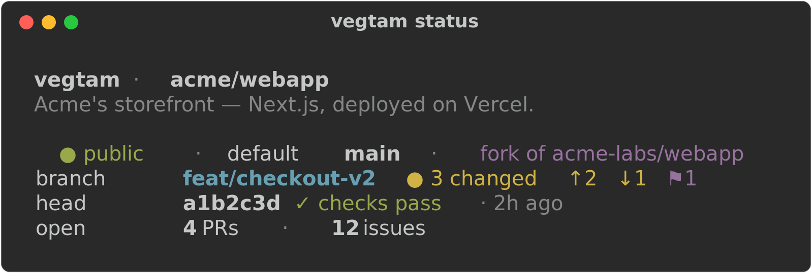
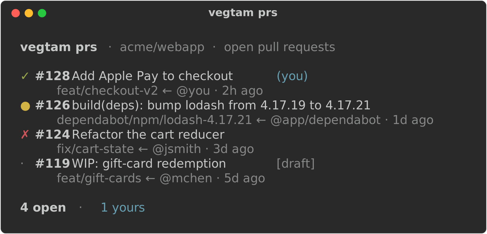
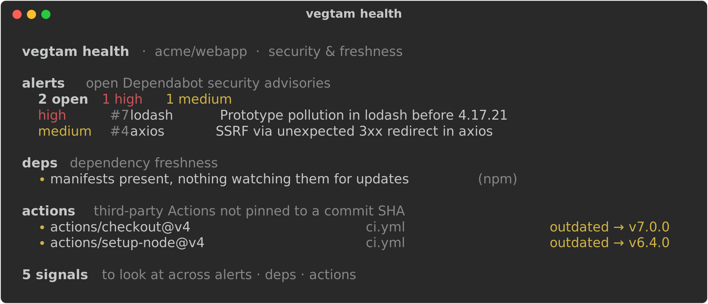
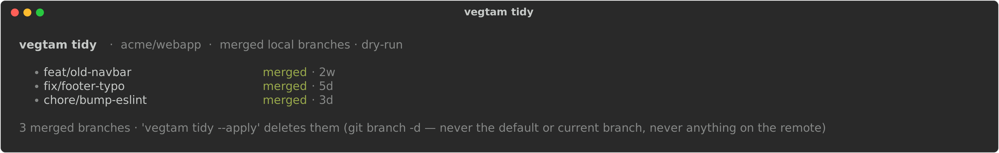

# vegtam

[](https://github.com/brett-buskirk/vegtam/actions/workflows/shellcheck.yml)

**The wanderer — a pocket CLI for whatever repo you're standing in.**

Odin walks Midgard in disguise under the name *Vegtam*. This tool is that mode: it works on
**exactly one repository — the one your shell is in right now** — reading everything live from the
local `.git` and its GitHub remote. No config, no stored state, no assumptions about who owns the
repo. Run it inside any repo, anywhere on the machine, and get a fast lay of the land.

<p align="center">
  
</p>

## Works in any repo. Owns nothing.

Vegtam is built for the repos that *aren't* yours — client work, an open-source contribution,
something you just cloned. That inverts the usual risk posture, so three rules hold throughout:

- **Read-first, act-light.** The value is in the *views*, and views are safe everywhere. The
  handful of actions are scoped to "help me work *in* this repo," never "clean up someone else's."
- **Convention-neutral.** Vegtam reports *what is*. It doesn't audit your repo against anyone's
  house style.
- **Permission-aware.** Contributor without admin? Read-only? Non-GitHub remote? Every remote call
  degrades to a quiet, informative line — never a crash or a stack trace.

Nothing Vegtam does touches remote state or your uncommitted work unless you explicitly ask — and
even then, the destructive-adjacent bits are dry-run by default.

## Install

Vegtam is a single, self-contained Bash script. Pick whichever fits:

**Homebrew** (macOS / Linux):

```sh
brew install brett-buskirk/tap/vegtam
```

**npm** (also gives you `npx vegtam` with no install):

```sh
npm install -g vegtam
```

**curl** — no package manager required, drop it straight on your `PATH`:

```sh
mkdir -p ~/.local/bin
curl -fsSL https://raw.githubusercontent.com/brett-buskirk/vegtam/main/vegtam -o ~/.local/bin/vegtam
chmod +x ~/.local/bin/vegtam
```

(Make sure `~/.local/bin` is on your `PATH`.)

**Requires** `bash` and `git` — so macOS, Linux, and WSL/Git Bash on Windows. The GitHub CLI (`gh`)
unlocks the GitHub-backed sections and `jq` enables `--json` output; without them, the local git
views still work.

## Usage

```
vegtam [status]      one-screen briefing on the current repo (the default)
vegtam branches      local + remote branches: tracking, merged, stale
vegtam prs           open pull requests with their CI status
vegtam log           timeline of commits, merged PRs, and releases
vegtam health        security & freshness: alerts, deps, unpinned actions
vegtam sync          fast-forward the current branch to its upstream
vegtam tidy          delete merged local branches (dry-run by default)
vegtam branch <name> create + switch to a branch
vegtam pr            open a PR from the current branch
vegtam help          the menu
vegtam <cmd> help    detail & options for any command
vegtam --version     print the version
```

For a one-page reference to every command, option, and `--json` shape, see the
[**cheat sheet**](CHEATSHEET.md).

### `status` — the flagship

One glance tells you where you stand:

- repo name, description, visibility, and default branch
- your relationship to it — a fork of whom, and how far ahead/behind its upstream you are
- current branch, dirty state, and stashes
- the latest commit, its CI status, and how long ago
- open PR and issue counts

Fast and local by default; add `--fetch` to refresh ahead/behind from the remote first. Respects
`NO_COLOR` and prints plain text when piped.

### `branches`

Your local branches, newest commit first — each with its upstream tracking state (`↑ahead`/
`↓behind`, `[gone]`, or `local-only`), whether it's merged into the default branch, and its age —
followed by the branches on `origin` you don't have locally. Purely descriptive; it never deletes
anything (that's what [`tidy`](#tidy) is for). `--fetch` refreshes tracking and remote branches first.

### `prs`

Open pull requests, each with a CI glyph (`✓` pass · `✗` fail · `●` running · `·` none), its
source branch, author, and age. The ones you authored are tagged `(you)`.

<p align="center">
  
</p>

### `log`

A newest-first timeline of what changed: commits on the current branch (`●`), merged PRs (`⑃`),
and releases (`⚑`). `--since <window>` sets how far back to look — `6h`, `3d`, `2w` (default),
`1mo`. Commits always work; the GitHub events need `gh`.

### `health`

Security & freshness — three neutral, widely-recommended signals, each best-effort and
access-aware:

- **alerts** — open Dependabot advisories by severity (needs security read; a contributor usually
  can't see these, so it degrades to a note)
- **deps** — dependency manifests with nothing watching them, and open Dependabot update PRs
- **actions** — third-party Actions not pinned to a commit SHA (the supply-chain hardening
  recommendation), flagged outdated when a newer major exists

It reports what *is* — it doesn't judge the repo against anyone's house style, and it changes
nothing.

<p align="center">
  
</p>

### `--json`

Every inspect view above takes `--json` (needs `jq`), emitting a structured object or array for
piping into other tools. Fields you can't read come through as `null`, so a consumer can tell
"no access" from "none found":

```sh
vegtam status --json | jq '.behind'                 # am I behind upstream?
vegtam prs --json    | jq '[.[] | select(.mine)]'   # just my open PRs
vegtam health --json | jq '.alerts.open // 0'       # open Dependabot alerts (null → 0)
```

## Actions — safe, local, self-scoped

The only commands that change anything. Each helps you work *in* this repo; none touch remote
branches, close others' PRs, or rewrite history.

### `sync`

Fetch, then **fast-forward** the current branch to its upstream — nothing more. If your branch has
diverged (you have local commits the remote doesn't), it says so and stops; reconciling means a
rebase or merge, which it won't do for you. A clean fast-forward proceeds even with an unrelated
dirty file — git itself refuses to overwrite uncommitted changes, so your work is never clobbered.

### `tidy`

Delete local branches already merged into the default branch. **Dry-run by default** — it lists what
it *would* delete and changes nothing until you add `--apply` (which confirms once for the batch;
`--yes` skips the prompt). Never the default branch, never the one you're on, never anything on the
remote, and only via `git branch -d` (which itself refuses a branch that isn't fully merged).

<p align="center">
  
</p>

### `branch <name>`

Create a branch and switch to it — or just switch, if it already exists. Purely local; nothing is
pushed.

### `pr`

Open a pull request from the current branch — a thin wrapper over `gh pr create`. It refuses on a
detached HEAD, the default branch, or a branch with no commits beyond the base (nothing to open),
then hands off to `gh`, which pushes the branch if needed (via a fork when you can't push to origin)
and prompts for the rest. Extra flags pass straight through (`vegtam pr --fill --draft`).

## Status

**v1.0.0** — stable and feature-complete for v1: five inspect views (each with `--json`), four safe
local actions, two-level help, `shellcheck`-gated CI, one self-contained script.

Anything remote-mutating or destructive beyond the safe local set is deliberately out of scope —
that's not what a wanderer is for. See [ROADMAP.md](ROADMAP.md) for what's intentionally deferred.

## License

MIT — see [LICENSE](LICENSE).
